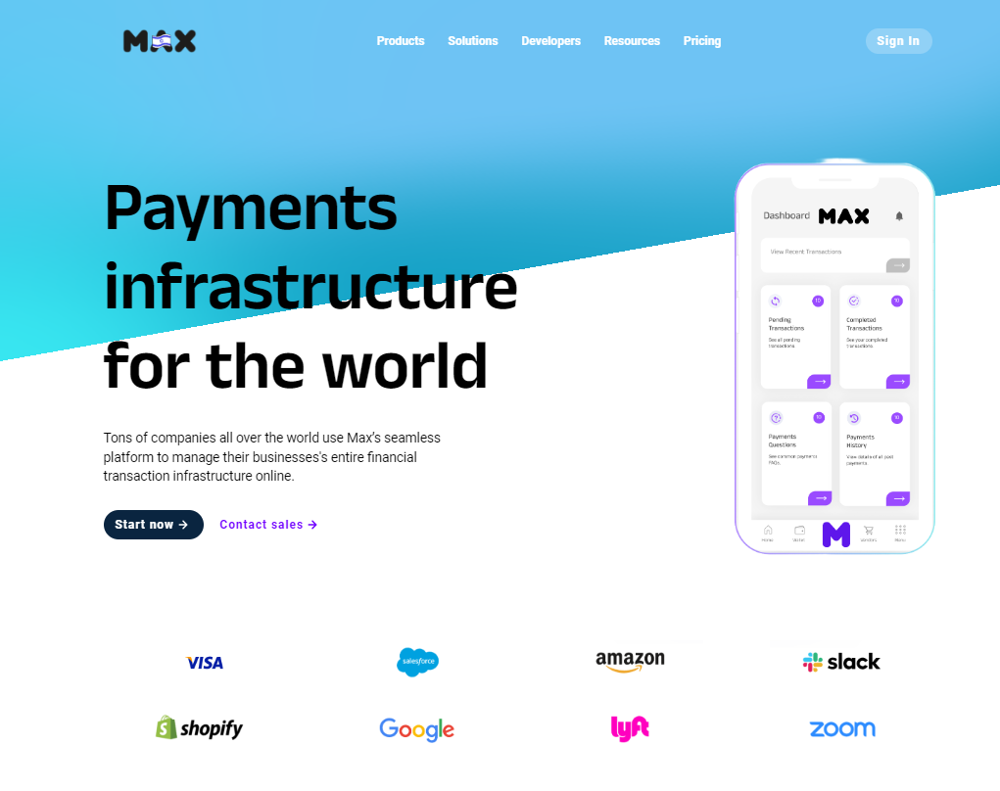
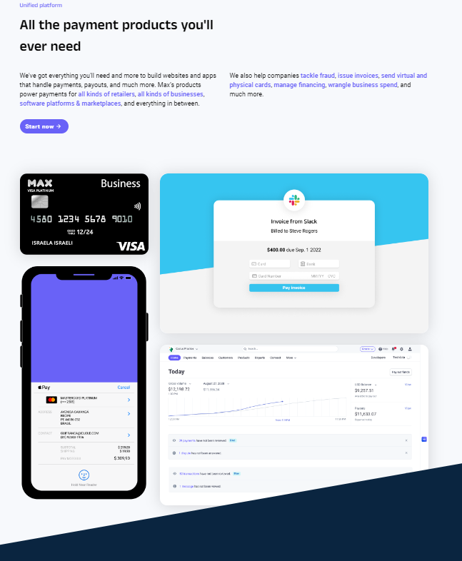
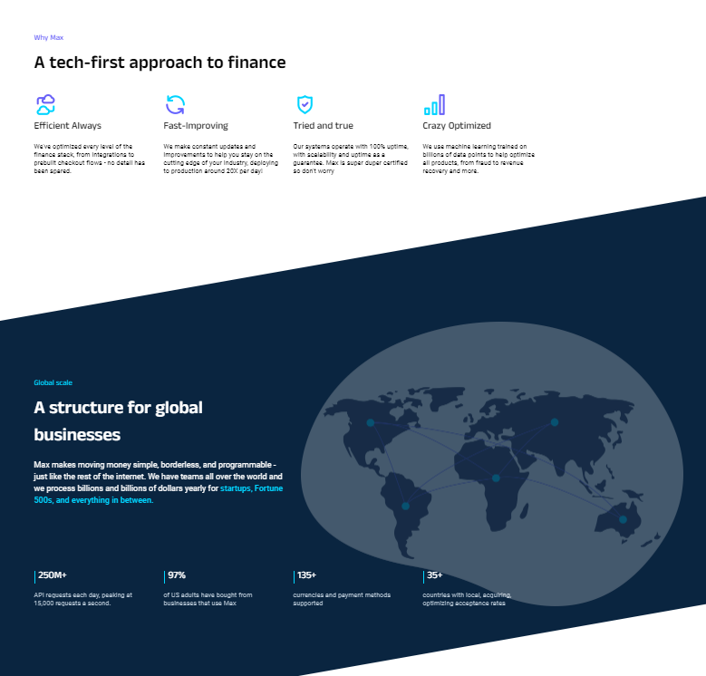

# Max Finance Website

## [Watch the demo video](https://vimeo.com/948267775)

## Description
I completed an HTML-CSS bootcamp course in my free time during the semester as part of my self-learning journey, which greatly contributed to the development of this website.
Currently, it is a static web project that uses HTML and CSS, with the addition of JavaScript for implementing gradient effects.
The Max Finance website is a frontend project aimed at showcasing Max's payments infrastructure solutions to potential users and clients. 

## Screenshot

## Installation

To run the project locally, follow these steps:

1. Clone the repository to your local machine.
2. Open the project directory in your code editor.
3. Run a local server (e.g., using VS Code's Live Server extension) to preview the website.

 

